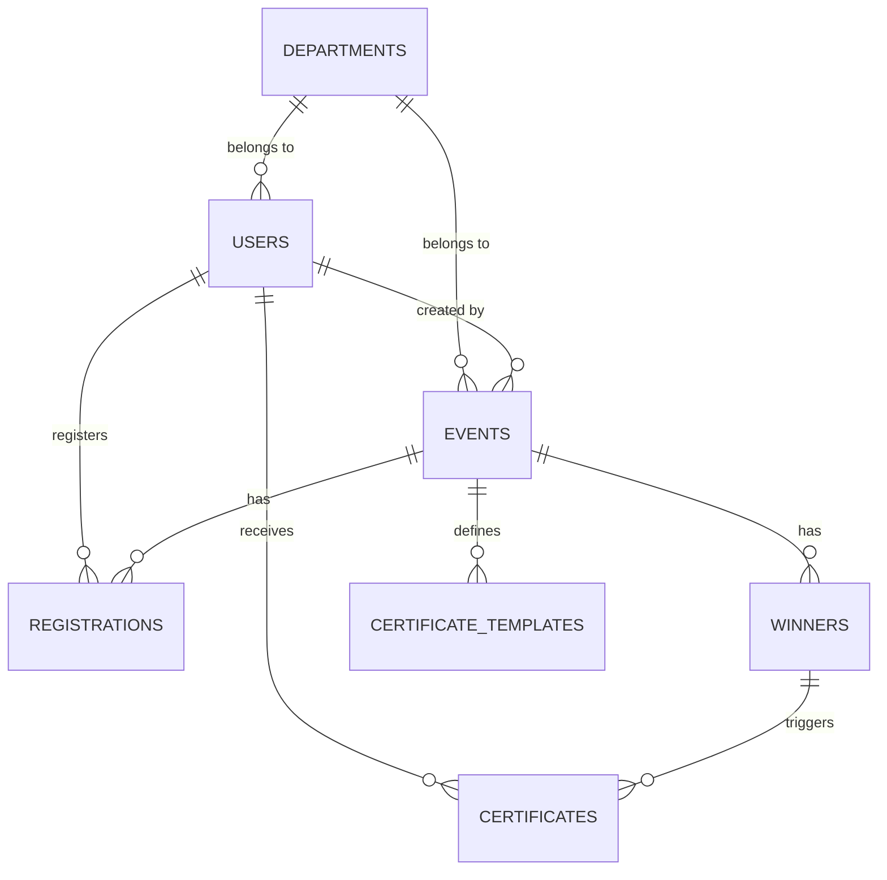

# SICM EMS — Database Schema

The system uses a relational PostgreSQL database provided by Supabase. Data access is governed by Row Level Security (RLS) policies based on the user's role and ownership.

## 📊 Core Tables

### `users`
Stores all account information for students, teachers, and admins.
- **Fields**: `id`, `name`, `email`, `role`, `department_id`, `programme`, `semester`, `is_active`, `must_change_password`.
- **Roles**: `student`, `teacher`, `admin`.

### `departments`
Organizational units within the college.
- **Fields**: `id`, `name`, `is_active`.

### `events`
The central entity for all activities.
- **Fields**: `id`, `title`, `description`, `event_date`, `status` (draft, open, closed, completed), `visibility`, `department_id`, `created_by`.
- **Relationships**:
  - Belongs to a Department.
  - Tracked by one or more Faculty-in-Charge.

### `individual_registrations`
Tracks which student is registered for which event.
- **Fields**: `student_id`, `event_id`, `attendance_status` (registered, attended, absent).

### `teams` & `team_members`
Handles group-based event participation.
- **Fields**: `id`, `team_name`, `event_id`, `created_by`.

### `winners`
Stores the results of completed events.
- **Fields**: `event_id`, `student_id` (optional), `team_id` (optional), `position_label` (e.g., "1st place").

### `certificate_templates`
Design layouts for certificates.
- **Fields**: `event_id`, `template_name`, `layout_json` (coordinates for names, dates, etc.), `background_image_url`.

### `certificates`
The actual record of a generated certificate.
- **Fields**: `student_id`, `event_id`, `file_path` (link to Supabase Storage), `status` (pending, generated, failed).

---

## 🔗 Entity Relationship Diagram (Conceptual)

## 🛡️ Security (RLS)
- **Students**: Can read all active events; can read their own registrations and certificates.
- **Teachers**: Can manage events in their department; can view all students in their department.
- **Admins**: Full bypass/access to all tables.
